# ACM CSS Application

> A flutter firebase application for ACM society of our college 

<br>

## Table of Contents
* [About the Project](#-about-the-project)
* [Requirements](#-requirements)
* [Running the Project](#-running-the-Project)
* [Some useful links to learn flutter](#-some-useful-links-to-learn-flutter)
* [Links](#-links)
* [ScreenShots](#-screenshots)
* [Contributors](#-contributors)

<br>

### ✍&nbsp; About the Project

The application is built using Flutter and Firebase for Google Sign in and OTP verification. The main aim to build this application is to know more about the ACM society of our college and be updated about it. The application also keeps the record for the previously attended workshops. The application is featured with the ability to mark attendance using QR Code Scanner.

<br>

### ✅&nbsp; Requirements:

=> Latest Flutter SDK and Dart SDK with firebase credentials like ```google-services.json``` file

=> Internet connectivity for Google Sign in and OTP verification.
    
<br>

### 📫&nbsp; Running the Project:

=> Open your Git Bash command window and in the root directory type the following commands:

    1) git init -initializes the git repository from the GitHub. 
    2) git clone -Clone the repository to your local machine
=> Open your Android IDE:

    1) Open the file at the root directory
    2) Code your modifications in the project

<br>

### 🚀&nbsp; Some useful links to learn flutter:

- [Lab: Write your first Flutter app](https://flutter.dev/docs/get-started/codelab)
- [Cookbook: Useful Flutter samples](https://flutter.dev/docs/cookbook)

For help getting started with Flutter, view our
[online documentation](https://flutter.dev/docs), which offers tutorials,
samples, guidance on mobile development, and a full API reference.

<br>

### 📃&nbsp; Document:

-```Link for the documentation of project```(https://docs.google.com/document/d/1OGa8ekoK7Ycjnlv58_eXy75ArHQsuQTZ0FAjoNIKp7w/edit?usp=sharing)

<br>

### 📷&nbsp; ScreenShots:
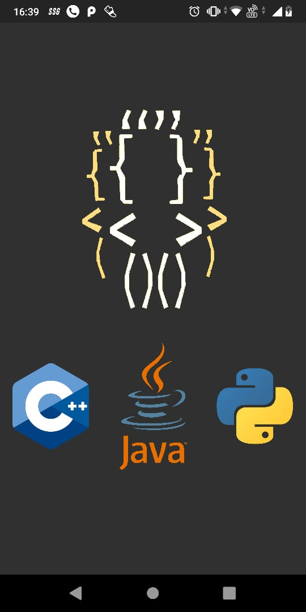  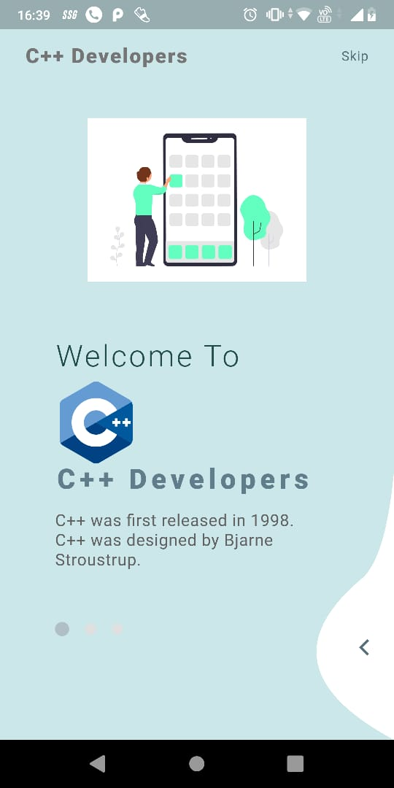  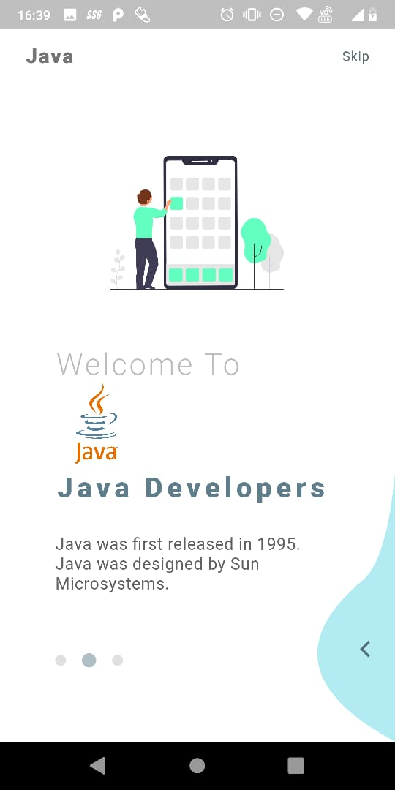

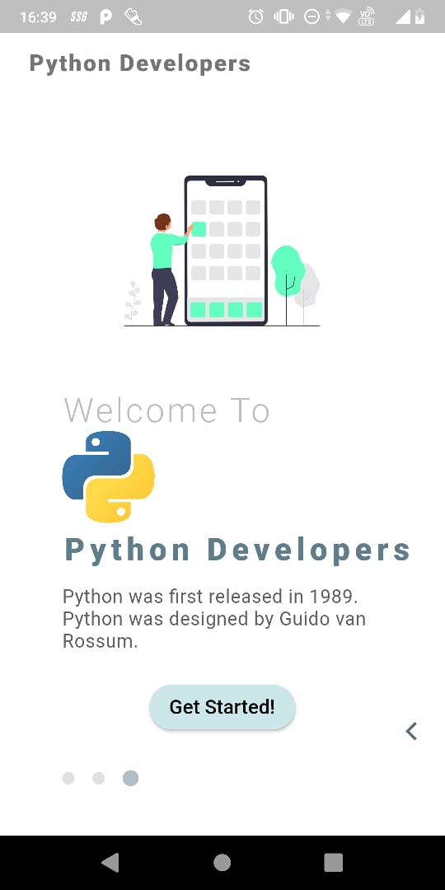  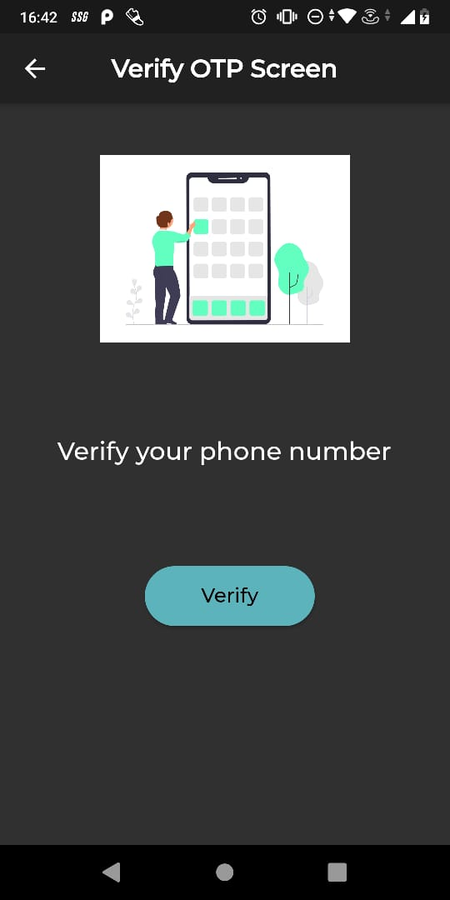  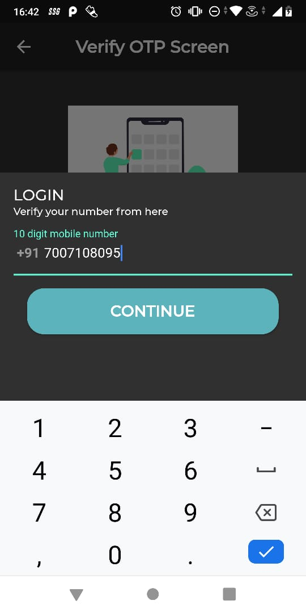

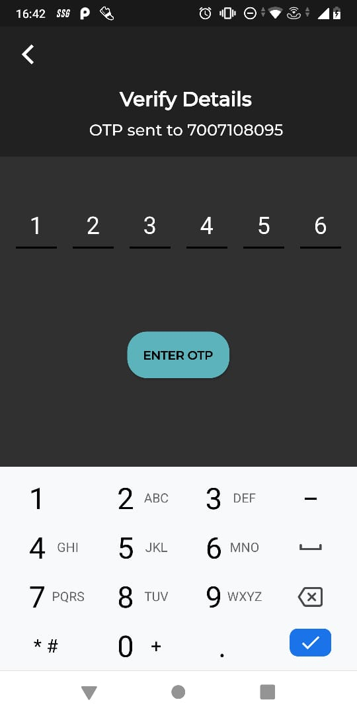  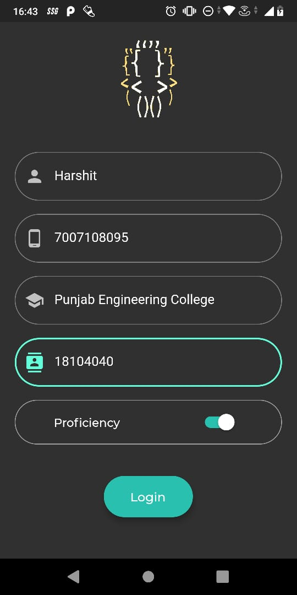  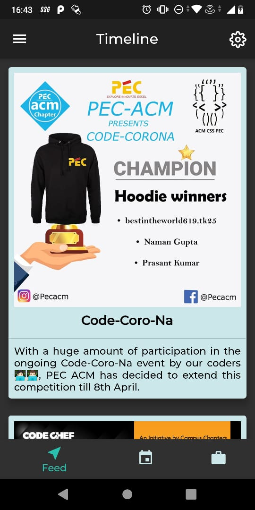

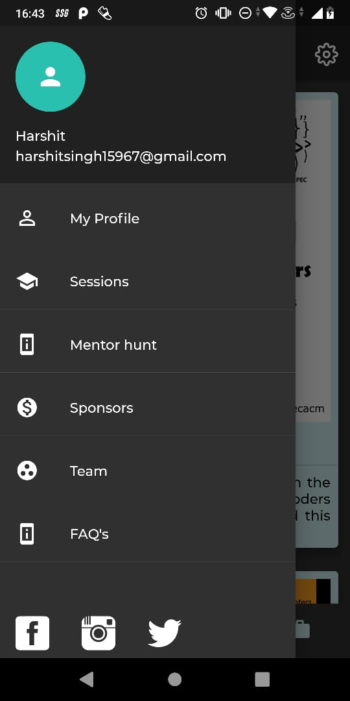  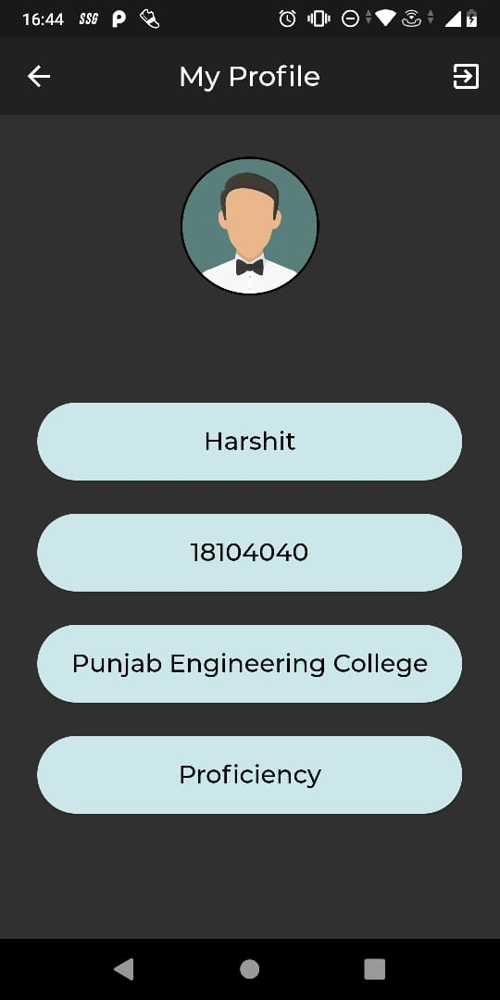  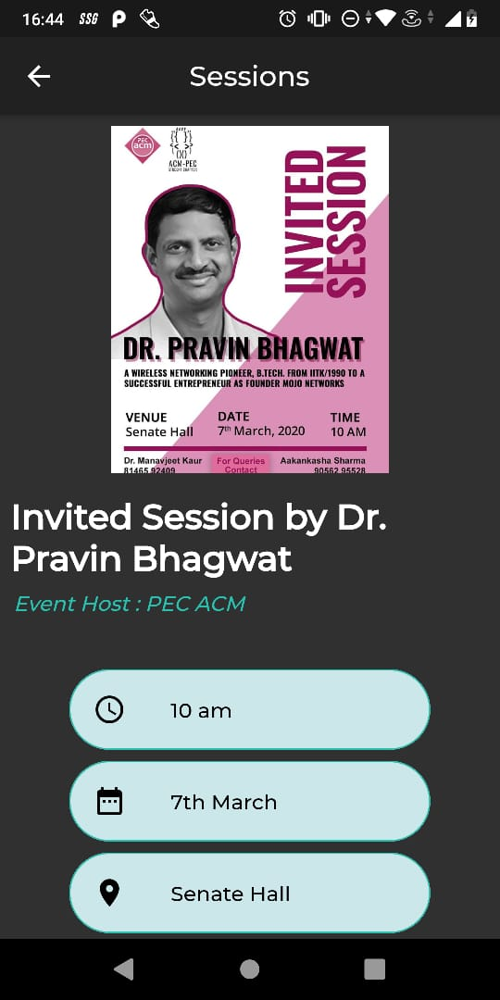

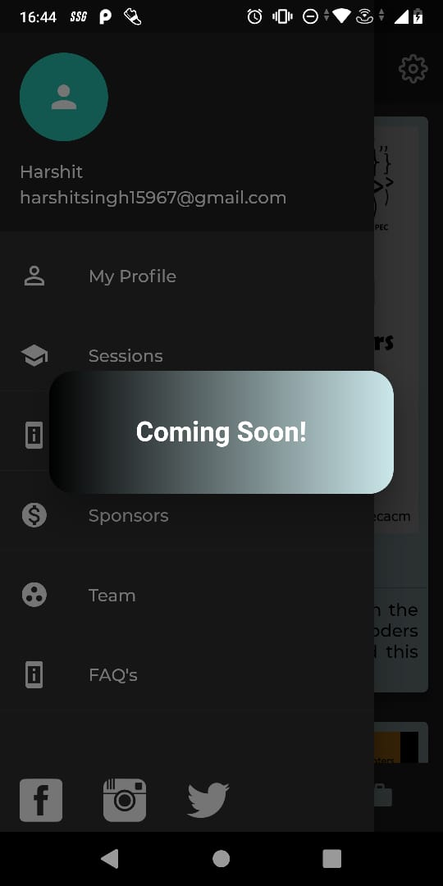  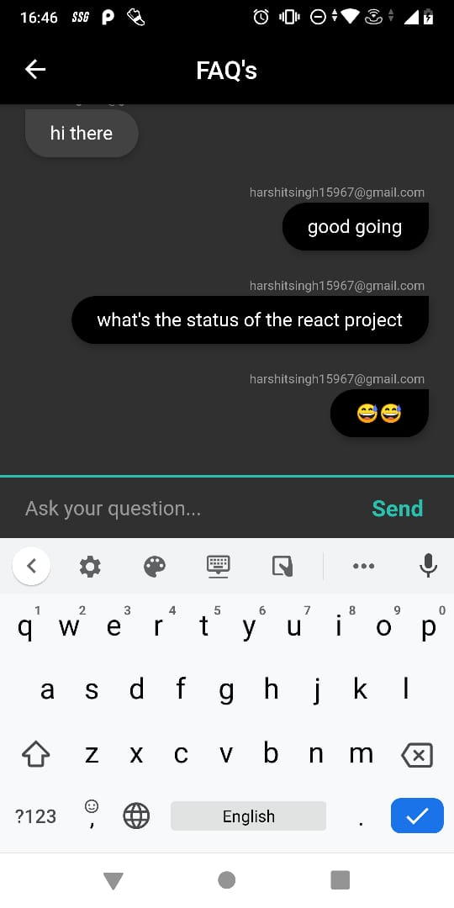  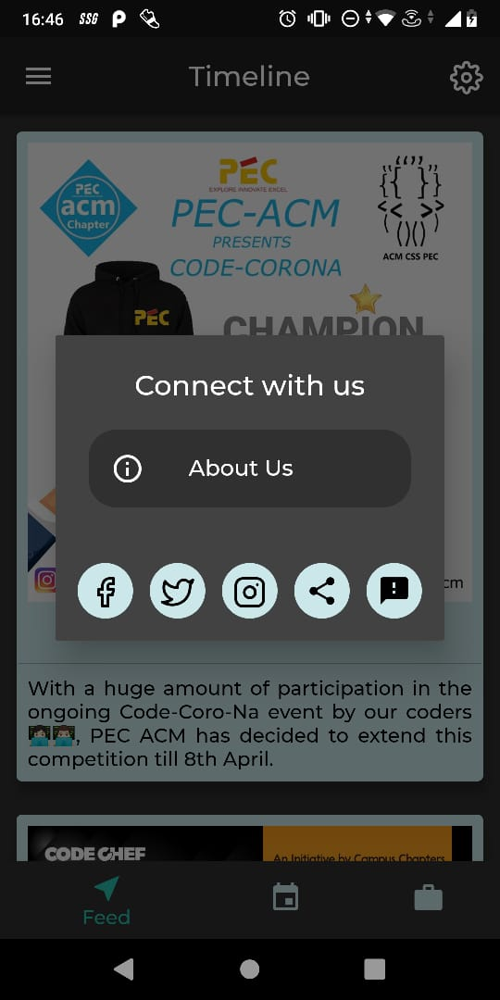

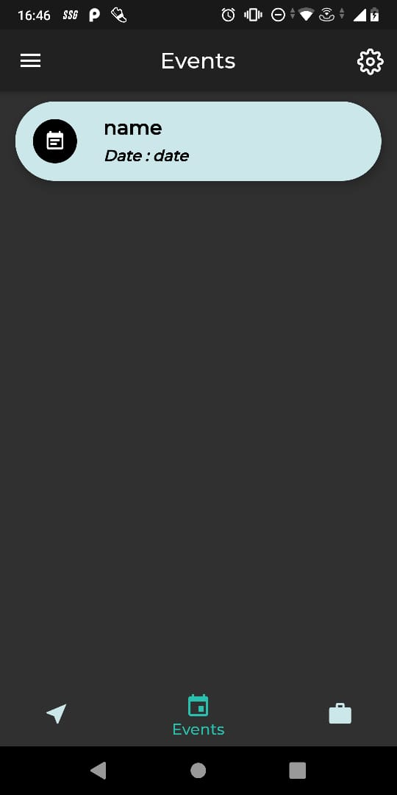  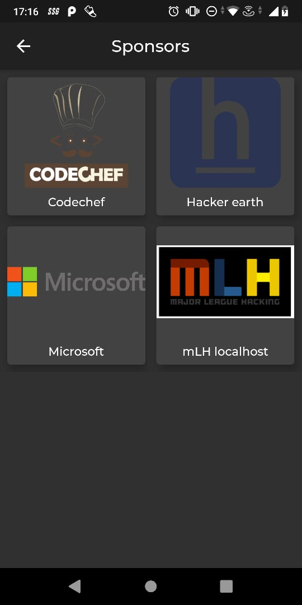  

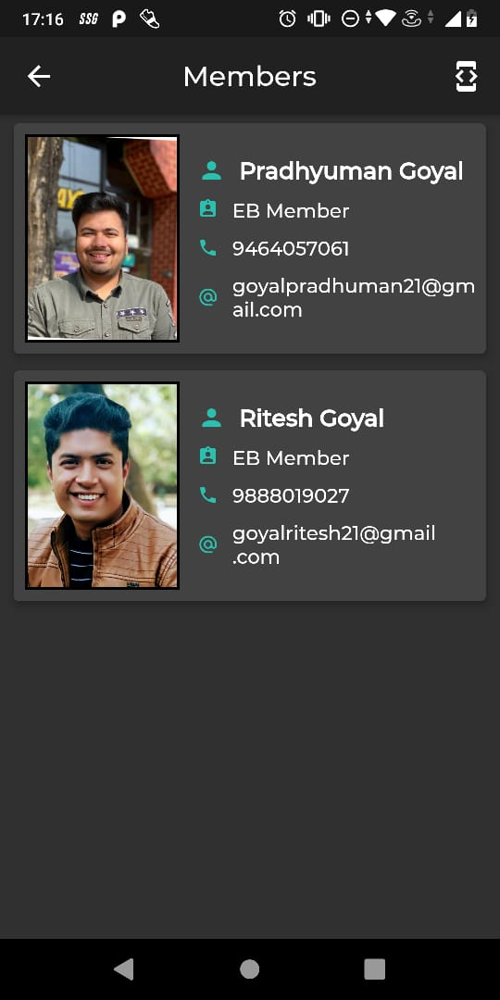  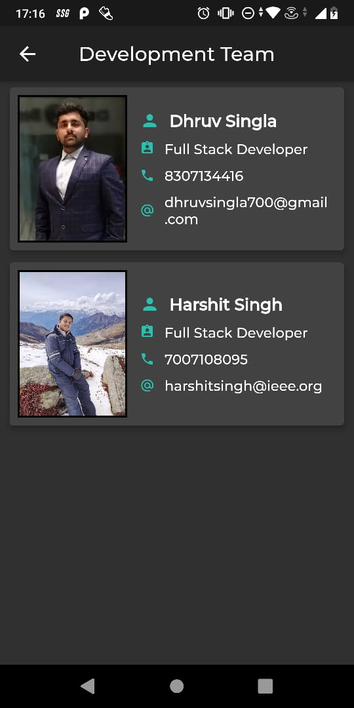  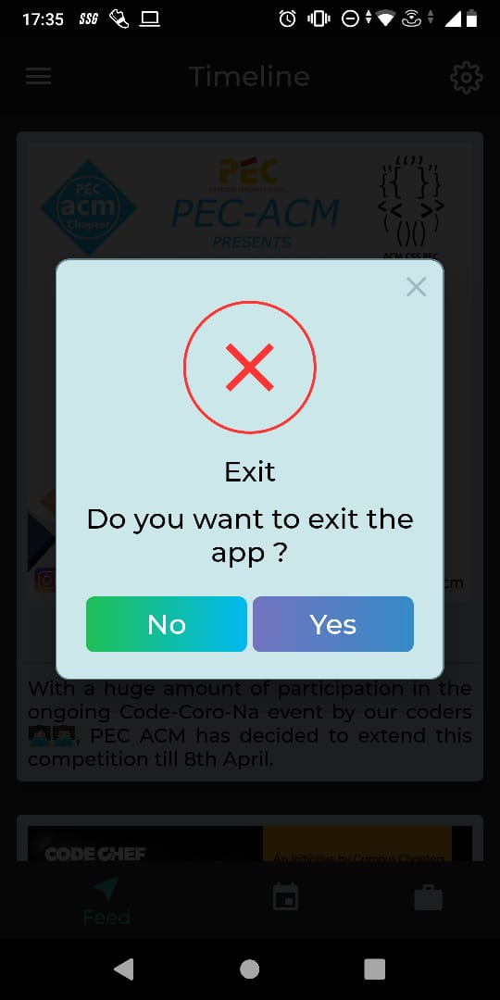

<br>

### ✨&nbsp; Contributors:

<table><tr><td align="center"><a href="https://github.com/DhruvSingla007"><br /><sub><b>Dhruv</b></sub></a></td><td align="center"><a href="https://github.com/Harshit564"><br /><sub><b>Harshit</b></sub></a></td>

